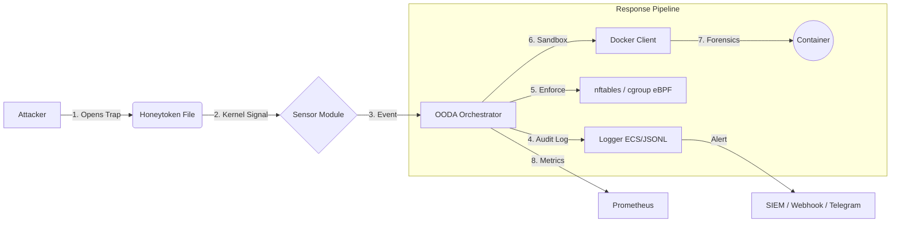

<div align="center">

# Phantom Files Daemon

**Advanced Active Defense & Deception System for Linux**

[](https://python.org)
[](https://docker.com)
[](LICENSE)
[]()
[](README_ru.md)

<p align="center">
  <a href="#key-features">Key Features</a> •
  <a href="#architecture">Architecture</a> •
  <a href="#quick-start">Quick Start</a> •
  <a href="#configuration">Configuration</a> •
  <a href="#api">API</a> •
  <a href="#operations">Operations</a>
</p>

</div>

---

## Overview

**Phantom Files** is a lightweight, system-level daemon that turns your infrastructure into a minefield for attackers. It implements **Deception** tactics by automatically deploying high-fidelity **polymorphic honeytokens** (fake files) and monitoring them in real-time.

Unlike passive honeypots, Phantom Files acts as an **Active Defense** system. Upon detecting access to a trap file, it executes the full **OODA loop** (Observe → Orient → Decide → Act): collects process/network telemetry, scores threat severity, makes an enforcement decision, and carries it out — all within milliseconds.

> **Philosophy:** "Zero False Positives." Legitimate users have no business touching these files. Any interaction is a confirmed high-fidelity security incident.

---

## Key Features

### 1. Polymorphic Trap Factory
The system synthesizes files rather than just copying them. Every deployment is unique.
*   **Template-Based Generation:** Uses **Jinja2** (SandboxedEnvironment) + **Faker** to generate syntactically valid configuration files (`.json`, `.yaml`, `.env`, `.ovpn`, `.sh`) filled with realistic fake credentials.
*   **Shared Legend Context:** All traps share a consistent narrative (same fake admin identity, internal IP ranges, and passwords) across the system.
*   **Binary Polymorphism:** Implements **Steganographic Watermarking** for binary files (`.docx`, `.xlsx`, `.pdf`). Injects unique IDs into ZIP comments or file tails.
*   **Trap Rotation:** Time-based rotation with configurable interval, batch size, and round-robin selection. Mutates content to change hash sums without altering file semantics.
*   **Category Manifests:** Separate YAML manifests for credentials, infrastructure, kubernetes, and documents.

### 2. Anti-Forensics & Time Stomping
*   **Time Stomping:** Automatically manipulates `atime` and `mtime` of generated traps. Files appear to be created months ago (randomized 10–300 days), bypassing heuristic analysis that looks for "freshly created" baits.

### 3. Kernel-Level Monitoring (Multi-Sensor)
*   **Primary:** `fanotify` PERM events with fail-close timeout → deny. Intercepts `OPEN`/`ACCESS` before the process reads the file.
*   **Auxiliary:** eBPF kprobe sensor for rich telemetry (PID, UID, fd, flags).
*   **Fallback:** `inotify` (via Watchdog) for degraded mode on non-root or older kernels.
*   **Low Overhead:** The daemon sits idly until a trap is touched, consuming negligible CPU resources.

### 4. OODA Orchestrator
*   **Observe:** Event ingestion with deduplication and incident aggregation.
*   **Orient:** Threat analysis — process ancestry, network connections, anomaly scoring (0.0–1.0).
*   **Decide:** Policy-driven decision engine mapping threat scores to response actions.
*   **Act:** Dispatcher executes actions: `log_only`, `alert`, `collect_forensics`, `isolate_process`, `block_network`, `block_ip`, `kill_process`.

### 5. Automated Forensic Response
*   **Ephemeral Sandbox:** Spawns a **Docker container** (read-only FS, no network, cap_drop=ALL, mem/pids limits) for dynamic analysis.
*   **eBPF Pre-Capture:** Ring buffer captures network packets before and after the incident.
*   **Evidence Chain:** SHA-256 + Ed25519 signing + AES-256-GCM encryption (fail-closed). S3/MinIO upload with Object Lock.
*   **Memory Dump:** `process_vm_readv` → `/proc/<pid>/mem` → `gcore`/`avml` fallback chain.

### 6. Network Enforcement
*   **nftables** IP blacklist (IPv4/IPv6 sets with TTL).
*   **cgroup eBPF** process isolation (ingress/egress drop).
*   **UID-based** output filtering via nftables skuid set.

### 7. REST API (ASGI)
*   **Starlette + uvicorn** with optional TLS.
*   **JWT** (HMAC-SHA256) + API key + mTLS authentication.
*   **RBAC:** admin / editor / viewer roles.
*   **Rate limiting:** Token bucket per IP (configurable, skips `/health` and `/metrics`).
*   **Prometheus** `/metrics` and `/health` endpoints.
*   **Mode change forbidden via API** — CLI only with root privileges.

### 8. Alerting & Integrations
*   **Webhook** with SSRF protection and exponential backoff retry.
*   **Telegram** bot notifications.
*   **Syslog** (RFC 5424) export.
*   **File-backed alert queue** for offline resilience.

---

## Architecture



---

## Quick Start

### Prerequisites
*   Linux (Ubuntu/Debian/Arch), kernel >= 5.10
*   Python 3.10+
*   Docker Engine

### Installation

1.  **Clone the repository:**
    ```bash
    git clone https://github.com/your-username/phantom-daemon.git
    cd phantom-daemon
    ```

2.  **Install dependencies & build image:**
    ```bash
    make install
    ```

3.  **Bootstrap system prerequisites (user/groups/dirs):**
    ```bash
    sudo phantomctl bootstrap
    ```

4.  **Validate configuration:**
    ```bash
    phantomctl validate
    ```

5.  **Run production readiness check:**
    ```bash
    phantomctl prod-check
    ```

6.  **Run the daemon:**
    ```bash
    sudo phantomd
    ```

---

## Configuration

Main config: `config/phantom.yaml`

```yaml
paths:
  traps_dir: "/var/lib/phantom/traps"
  logs_dir: "/var/log/phantom"
  evidence_dir: "/var/lib/phantom/evidence"

sensors:
  driver: "auto"        # fanotify + eBPF, fallback to inotify
  ebpf_enabled: true

orchestrator:
  mode: "active"        # active | observation | dry_run
  worker_count: 4
  fail_close: true

rotation:
  enabled: true
  interval_seconds: 3600
  batch_size: 5

api:
  enabled: true
  port: 8787
  security_mode: "api_key" # api_key | jwt | both | mtls

sandbox:
  enabled: true
  image: "phantom-forensics:v2"
  timeout_seconds: 60
  network_disabled: true

telemetry:
  process:
    collect_env: false
```

Trap manifests: `config/manifests/credentials.yaml`, `infrastructure.yaml`, `kubernetes.yaml`, `documents.yaml`.

---

## API

See [docs/API.md](docs/API.md) for the full API reference.

| Endpoint | Method | Auth | Description |
|---|---|---|---|
| `/health` | GET | None | Health check |
| `/metrics` | GET | None | Prometheus metrics |
| `/api/v1/auth/token` | POST | API key | Issue JWT token pair |
| `/api/v1/auth/refresh` | POST | JWT | Refresh access token |
| `/api/v1/incidents` | GET | JWT/Key | List incidents |
| `/api/v1/blocks` | GET/POST | JWT/Key | List/create blocks |
| `/api/v1/templates` | GET/POST | JWT/Key | Manage templates |
| `/api/v1/policies` | GET/PUT/PATCH | JWT/Key | Manage policies |

---

## CLI

```bash
phantomctl validate              # Validate configuration
phantomctl prod-check            # Production readiness checks
phantomctl bootstrap             # Create phantom user/groups/dirs (sudo)
phantomctl mode get              # Show current mode
sudo phantomctl mode set active  # Change mode (requires root)
phantomctl templates list        # List user templates
```

---

## Documentation

- `docs/API.md` — REST API reference
- `docs/CONFIG.md` — Full configuration reference
- `docs/RUNBOOK.md` — Operations runbook
- `docs/threat-model.md` — Threat model and trust boundaries
- `docs/architecture.md` — Architecture overview

## Operations

See [docs/RUNBOOK.md](docs/RUNBOOK.md) for the operations runbook.

### Hot Reload
Send `SIGHUP` to the daemon process. It performs atomic swap with drain:
1. Pause sensors
2. Drain event queue
3. Redeploy traps
4. Start new sensors
5. Stop old sensors

### Packaging
```bash
make package-deb    # Build .deb
make package-rpm    # Build .rpm
```

### Logrotate
External logrotate config: `deploy/phantom.logrotate` (daily, 30 days, compress). Includes `*.log` and `*.jsonl` (audit + alert queue).

---

## Development

```bash
make test           # Run tests
make test-unit      # Run unit tests
make test-integration # Run integration tests
make test-slow      # Run slow tests
make test-cov       # Tests with coverage
make lint           # ruff + black check
make fmt            # Auto-format
```

---

## License

Distributed under the Apache 2.0 License. See `LICENSE` for more information.
