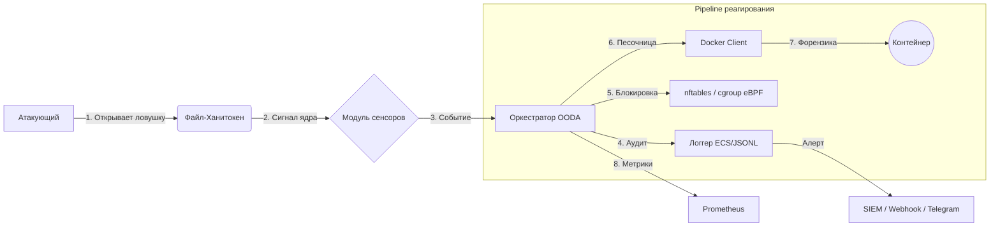

<div align="center">

# Phantom Files Daemon

**Продвинутая система активной защиты и Deception для Linux**

[](https://python.org)
[](https://docker.com)
[](LICENSE)
[]()
[](README.md)

<p align="center">
  <a href="#ключевые-возможности">Возможности</a> •
  <a href="#архитектура">Архитектура</a> •
  <a href="#быстрый-старт">Запуск</a> •
  <a href="#конфигурация">Настройка</a> •
  <a href="#api">API</a> •
  <a href="#эксплуатация">Эксплуатация</a>
</p>

</div>

---

## О проекте

**Phantom Files** — это легковесный системный демон, превращающий инфраструктуру в минное поле для злоумышленников. Реализует тактику **Deception** (обман), автоматически размещая высокоточные **полиморфные ханитокены** (файлы-ловушки) и отслеживая доступ к ним в реальном времени.

В отличие от пассивных ханипотов, Phantom Files действует как система **активной защиты**. При обнаружении доступа к файлу-ловушке демон выполняет полный цикл **OODA** (Observe → Orient → Decide → Act): собирает телеметрию по процессам и сети, оценивает уровень угрозы, принимает решение о реагировании и выполняет его — всё за миллисекунды.

> **Философия:** «Ноль ложных срабатываний». Легитимные пользователи не взаимодействуют с этими файлами. Любое касание ловушки — подтверждённый инцидент безопасности.

---

## Ключевые возможности

### 1. Полиморфная фабрика ловушек
Система синтезирует файлы, а не просто копирует. Каждое развёртывание уникально.
*   **Генерация по шаблонам:** Связка **Jinja2** (SandboxedEnvironment) + **Faker** — синтаксически верные конфигурационные файлы (`.json`, `.yaml`, `.env`, `.ovpn`, `.sh`) с реалистичными фейковыми данными.
*   **Связанная легенда:** Все ловушки объединены общим контекстом (имя админа, IP-диапазоны, пароли).
*   **Бинарный полиморфизм:** Стеганографические водяные знаки для `.docx`, `.xlsx`, `.pdf`. Уникальные ID в ZIP-комментариях или хвостах файлов.
*   **Ротация ловушек:** Периодическое обновление содержимого по таймеру (round-robin, настраиваемый интервал и размер батча). Мутация хеша без изменения семантики.
*   **Манифесты по категориям:** Отдельные YAML-манифесты для credentials, infrastructure, kubernetes, documents.

### 2. Анти-форензика и Time Stomping
*   **Подделка меток времени:** Автоматическая манипуляция `atime` и `mtime`. Файлы выглядят созданными месяцы назад (10–300 дней), обходя эвристический анализ.

### 3. Мониторинг на уровне ядра (мультисенсор)
*   **Основной:** `fanotify` PERM-события с fail-close по таймауту → запрет. Перехватывает `OPEN`/`ACCESS` до того, как процесс прочитает файл.
*   **Вспомогательный:** eBPF kprobe-сенсор для расширенной телеметрии (PID, UID, fd, flags).
*   **Резервный:** `inotify` (через Watchdog) для деградированного режима.
*   **Минимальная нагрузка:** Демон простаивает до касания ловушки.

### 4. Оркестратор OODA
*   **Observe:** Приём событий с дедупликацией и агрегацией инцидентов.
*   **Orient:** Анализ угроз — дерево процессов, сетевые соединения, скоринг аномалий (0.0–1.0).
*   **Decide:** Движок политик: маппинг оценки угрозы на действия реагирования.
*   **Act:** Диспетчер выполняет: `log_only`, `alert`, `collect_forensics`, `isolate_process`, `block_network`, `block_ip`, `kill_process`.

### 5. Автоматическая форензика
*   **Эфемерная песочница:** Docker-контейнер (read-only FS, без сети, cap_drop=ALL, лимиты mem/pids).
*   **eBPF предзахват:** Кольцевой буфер пакетов до и после инцидента.
*   **Цепочка улик:** SHA-256 + Ed25519 подпись + AES-256-GCM шифрование (fail-closed). Загрузка в S3/MinIO с Object Lock.
*   **Дамп памяти:** `process_vm_readv` → `/proc/<pid>/mem` → `gcore`/`avml` (цепочка фоллбэков).

### 6. Сетевое реагирование
*   **nftables:** Чёрный список IP (IPv4/IPv6 sets с TTL).
*   **cgroup eBPF:** Изоляция процессов (блокировка ingress/egress).
*   **UID-фильтрация:** nftables skuid set.

### 7. REST API (ASGI)
*   **Starlette + uvicorn** с опциональным TLS.
*   **JWT** (HMAC-SHA256) + API key + mTLS аутентификация.
*   **RBAC:** роли admin / editor / viewer.
*   **Rate limiting:** Token bucket по IP (настраиваемый, пропускает `/health` и `/metrics`).
*   **Prometheus** `/metrics` и `/health`.
*   **Смена режима запрещена через API** — только CLI с root-привилегиями.

### 8. Алертинг и интеграции
*   **Webhook** с SSRF-защитой и экспоненциальным retry.
*   **Telegram** бот-уведомления.
*   **Syslog** (RFC 5424) экспорт.
*   **Файловая очередь алертов** для устойчивости при недоступности сервисов.

---

## Архитектура



---

## Быстрый старт

### Требования
*   Linux (Ubuntu/Debian/Arch), ядро >= 5.10
*   Python 3.10+
*   Docker Engine

### Установка

1.  **Клонирование:**
    ```bash
    git clone https://github.com/your-username/phantom-daemon.git
    cd phantom-daemon
    ```

2.  **Установка зависимостей и сборка образа:**
    ```bash
    make install
    ```

3.  **Подготовка системы (пользователь/группы/каталоги):**
    ```bash
    sudo phantomctl bootstrap
    ```

4.  **Валидация конфигурации:**
    ```bash
    phantomctl validate
    ```

5.  **Проверка готовности к продакшну:**
    ```bash
    phantomctl prod-check
    ```

6.  **Запуск демона:**
    ```bash
    sudo phantomd
    ```

---

## Конфигурация

Основной конфиг: `config/phantom.yaml`

```yaml
paths:
  traps_dir: "/var/lib/phantom/traps"
  logs_dir: "/var/log/phantom"
  evidence_dir: "/var/lib/phantom/evidence"

sensors:
  driver: "auto"        # fanotify + eBPF, фоллбэк на inotify
  ebpf_enabled: true

orchestrator:
  mode: "active"        # active | observation | dry_run
  worker_count: 4
  fail_close: true

rotation:
  enabled: true
  interval_seconds: 3600
  batch_size: 5

api:
  enabled: true
  port: 8787
  security_mode: "api_key" # api_key | jwt | both | mtls

sandbox:
  enabled: true
  image: "phantom-forensics:v2"
  timeout_seconds: 60
  network_disabled: true

telemetry:
  process:
    collect_env: false
```

Манифесты ловушек: `config/manifests/credentials.yaml`, `infrastructure.yaml`, `kubernetes.yaml`, `documents.yaml`.

---

## API

См. [docs/API.md](docs/API.md) — полная справка по API.

| Endpoint | Метод | Аутентификация | Описание |
|---|---|---|---|
| `/health` | GET | Нет | Проверка состояния |
| `/metrics` | GET | Нет | Метрики Prometheus |
| `/api/v1/auth/token` | POST | API key | Выпуск пары JWT-токенов |
| `/api/v1/auth/refresh` | POST | JWT | Обновление access-токена |
| `/api/v1/incidents` | GET | JWT/Key | Список инцидентов |
| `/api/v1/blocks` | GET/POST | JWT/Key | Блокировки |
| `/api/v1/templates` | GET/POST | JWT/Key | Управление шаблонами |
| `/api/v1/policies` | GET/PUT/PATCH | JWT/Key | Управление политиками |

---

## CLI

```bash
phantomctl validate                # Валидация конфигурации
phantomctl prod-check              # Проверка готовности к продакшну
phantomctl bootstrap               # Создание пользователя/групп/каталогов (sudo)
phantomctl mode get                # Текущий режим
sudo phantomctl mode set active    # Смена режима (требует root)
phantomctl templates list          # Список пользовательских шаблонов
```

---

## Документация

- `docs/API.md` — справка по REST API
- `docs/CONFIG_ru.md` — полная справка по конфигурации
- `docs/RUNBOOK_ru.md` — операционный ранбук
- `docs/threat-model.md` — модель угроз и границы доверия
- `docs/architecture.md` — обзор архитектуры

## Эксплуатация

См. [docs/RUNBOOK_ru.md](docs/RUNBOOK_ru.md) — операционный ранбук.

### Горячая перезагрузка
Отправьте `SIGHUP` процессу демона. Выполняется атомарная подмена с дренажом:
1. Приостановка сенсоров
2. Дренаж очереди событий
3. Переразвёртывание ловушек
4. Запуск новых сенсоров
5. Остановка старых сенсоров

### Пакетирование
```bash
make package-deb    # Сборка .deb
make package-rpm    # Сборка .rpm
```

### Ротация логов
Внешний logrotate конфиг: `deploy/phantom.logrotate` (ежедневная ротация, 30 дней, сжатие). Ротируются `*.log` и `*.jsonl` (audit + очередь алертов).

---

## Разработка

```bash
make test           # Запуск тестов
make test-unit      # Unit-тесты
make test-integration # Интеграционные тесты
make test-slow      # Медленные тесты
make test-cov       # Тесты с покрытием
make lint           # ruff + black проверка
make fmt            # Автоформатирование
```

---

## Лицензия

Распространяется под лицензией Apache 2.0. Подробнее — файл `LICENSE`.
